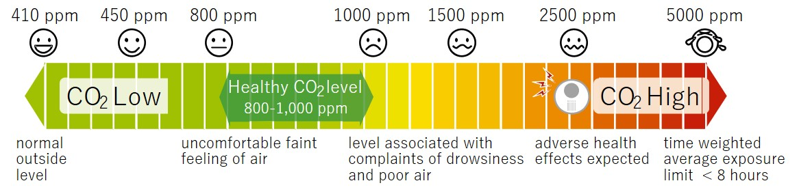
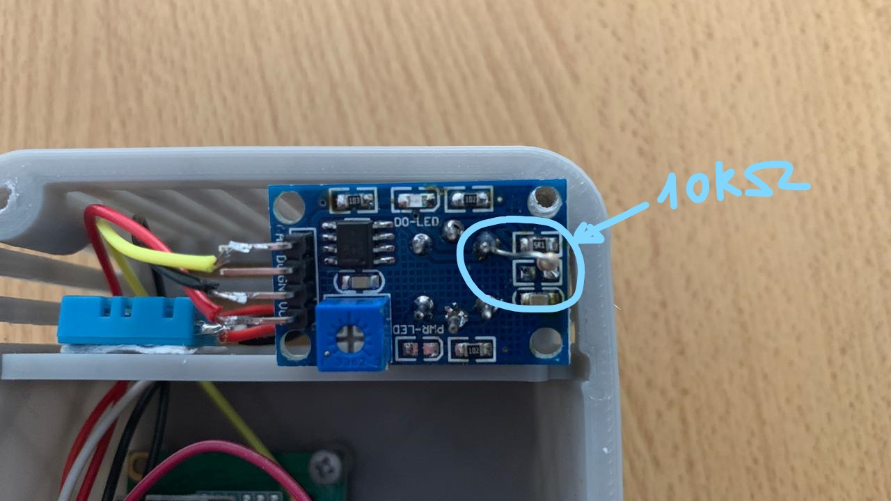

# Controla la calidad del aire de tu casa u oficina
Un sensor de CO2 es un instrumento que se utiliza para la medición de gas de dióxido de carbono en un ambiente determinado. Habitualmente estos aparatos registran el dióxido de carbono en partes por millón (ppm) en los espacios ocupados y nos ofrecen una muestra de la concentración de este gas en el aire que respiramos.

Este tipo de mediciones se han convertido en un elemento imprescindible en un entorno como el actual. Nuestras edificaciones son cada día más herméticas y, en consecuencia, mejor aisladas. La ventilación y concretamente la calidad del aire interior son aspectos primordiales relacionados con la salud y el confort de nuestras viviendas y espacios de trabajo sobre todo en esta epoca en donde nos vemos recluidos devido al COVID-19

Con la utilización de sensores de CO2 se pueden identificar las zonas o estancias habitadas en las que los niveles de dióxido de carbono son superiores a los aceptables. A partir de aquí habrá que diseñar o ajustar los sistemas de ventilación y el flujo de aire a estas necesidades con el fin de obtener la adecuada renovación y calidad del aire interior.

# Concentraciones habituales de CO2 y sus efectos
Como ya hemos comentado, las concentraciones de CO2 se miden en partes por millón (ppm). Dado que un elevado nivel de CO2 en el ambiente puede provocar efectos en la salud o en el rendimiento laboral, será aconsejable conocer los niveles considerados aceptables.

# Niveles válidos de concentración de CO2
Con relación a las concentraciones de CO2 los valores establecidos como válidos serían los siguientes:

- Concentraciones típicas de CO2 en ambientes exteriores: 350 – 450 ppm
- Concentraciones aceptables de CO2 en IAQ: 600 – 800 ppm
- Concentraciones tolerables de CO2 en IAQ: 1000 ppm

# Niveles de concentración de CO2 y sus efectos
Y en cuanto a los distintos niveles de concentración de CO2 (en ppm) y sus efectos sobre las personas se establecen los siguientes parámetros:

- Hasta 350 ppm; aire exterior
- Hasta 1.000 ppm; sensación de aire enrarecido
- Hasta 4.000 ppm; habitación mal ventilada
- Hasta 5.000 ppm; concentración máxima aconsejable en el lugar de trabajo.
- En concentraciones cercanas a los 30.000 ppm puede causar dolores de cabeza, falta de concentración, somnolencia, mareos y problemas respiratorios.

# Por que decimos que sirve para controlar el contagio de COVID-19
En la atmósfera, o sea, al aire libre, hay entre 350 y 450 partículas de CO2 por cada millón de partículas, eso significa que si estamos en un ambiente cerrado todo lo que esté por arriba de esos números está proveniendo de una fuente local. Asumimos que no estamos en un incendio ni trabajando con tubos de CO2 comprimidos o cualquier otra fuente, y por tanto lo único que quedaría que pueden generar CO2 son los seres vivos: humanos, animales, y plantas por la noche, pero excepto que vivas en un vivero es algo bastante despreciable.

O sea que en horarios diurnos si nuestro ambiente tiene 800 partículas por millón es asumible pensar que al menos un promedio de 400 de ellas fueron exhaladas por otro ser vivo. Si en el ambiente solo hay humanos, serían exhalados por otro humano. O sea que 400 de cada 1000000 de partículas el 0,4% del aire respirado fue exhalado previamente por nosotros mismos o alguien más.

El COVID-19 cae rápidamente al piso, por ello el usar tapabocas y mantener distancia es una forma relativamente buena de evitar el contagio, de estar en presencia de un enfermo de dicha patología (enfermo que podría ser asintomático). Aún así parte del spray exhalado aún queda en el aire, aquellas partículas más chicas y con menor masa, por tanto sin medimos el CO2 podemos tener una idea del grado de probabilidad de contagio al que nos sometemos al estar en el mismo ambiente cerrado con una persona contagiada que se encuentre a 2 metros de distancia y con tapabocas.

En resumen: si cumplimos con el distanciamiento social y el uso de mascarilla en un ambiente cerrado con 600 partículas por millón de CO2, tendremos un 0.4% de probabilidad de contagio, obviamente esa probabilidad aumenta con la distancia entre personas, el no uso de mascarilla y un ambiente con más de 2000 ppm de CO2, no es solución definitiva pero sin un elemento más de control, el cual es muy bueno en épocas de frío en donde tener todo el día la ventana abierta puede ser más problema que solucion.

# Elementos requeridos:
- 1x Arduino nano
- 1x Sensor MQ-135
- 1x DTH11
- Beeper activo
- Display de dos lineas con adaptador a I2C
- Cables

# Escquema:

# Pasos previos:
Antes de empezar deberemos instalar las librerías ubicadas en la capeta “Liberia” en nuestro entorno Arduino.
Por lo demás solo es conectar, cargar el código y disfrutar.

# Calibración:
El sensor MQ135 es muy basico, solo consiste en una resistencia que varía segun la cantidad de CO2 con la que se la exita, esto implica 2 puntos a tener en cuenta:
1) La resistencia 102 ubicada del lado de atras arriba (lado contrario a los pines de conexion) entre medio de un capacitor y una resistencia es de 1K, algo inconveniente para usar con una arduino, lo que no implica que no sirva, solo que podria hacer a nuestras lecturas algo erraticas por lo que se recomienda cambiar por una resistencia de 10K o de 22K. Hecho esto deberemos ir al archivo MQ135.h y cambiar el valor de RLOAD de 1.0 a 10.0 o 22.0 segun la resistencia que pongamos en remplazo.

2) Segun partida de sensores o marca es probable que varie el valor de la resistenciua interna del sensor, la llamada en el archivo MQ135.h como RZERO, algo que deberemos calibrar para tener mediciones correctas. Para ello nos llevaremos el equipo terminado al exterior (Balcon o terraza) y con el terminal abierto nos quedaremos viendo por al menos 10 a 15 minutos que el valor que se imprime en pantalla se estabilice en un numero. Ese numero es el que remplazaremos en RZero.

Compilamos y cargamos en la arduino nuevamente con los valores detectados y si esta todo OK deberemos medir de 390ppm a 490ppm valores "normales" para una medicion al aire libre. 
