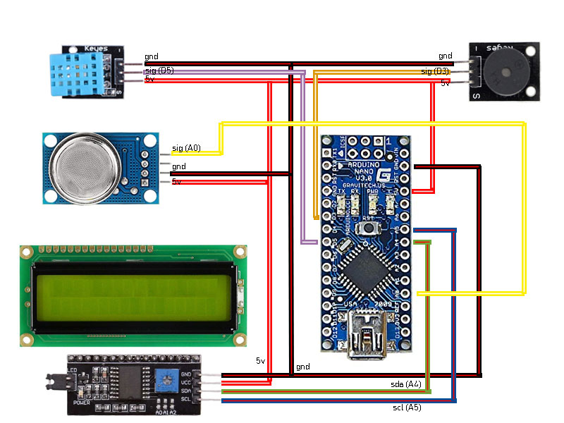

# Controla la calidad del aire de tu casa u oficina
Un sensor de CO2 es un instrumento que se utiliza para la medición de gas de dióxido de carbono en un ambiente determinado. Habitualmente estos aparatos registran el dióxido de carbono en partes por millón (ppm) en los espacios ocupados y nos ofrecen una muestra de la concentración de este gas en el aire que respiramos.

Este tipo de mediciones se han convertido en un elemento imprescindible en un entorno como el actual. Nuestras edificaciones son cada día más herméticas y, en consecuencia, mejor aisladas. La ventilación y concretamente la calidad del aire interior son aspectos primordiales relacionados con la salud y el confort de nuestras viviendas y espacios de trabajo sobre todo en esta epoca en donde nos vemos recluidos devido al COVID-19

Con la utilización de sensores de CO2 se pueden identificar las zonas o estancias habitadas en las que los niveles de dióxido de carbono son superiores a los aceptables. A partir de aquí habrá que diseñar o ajustar los sistemas de ventilación y el flujo de aire a estas necesidades con el fin de obtener la adecuada renovación y calidad del aire interior.

# Concentraciones habituales de CO2 y sus efectos
Como ya hemos comentado, las concentraciones de CO2 se miden en partes por millón (ppm). Dado que un elevado nivel de CO2 en el ambiente puede provocar efectos en la salud o en el rendimiento laboral, será aconsejable conocer los niveles considerados aceptables.

# Niveles válidos de concentración de CO2
Con relación a las concentraciones de CO2 los valores establecidos como válidos serían los siguientes:

- Concentraciones típicas de CO2 en ambientes exteriores: 350 – 450 ppm
- Concentraciones aceptables de CO2 en IAQ: 600 – 800 ppm
- Concentraciones tolerables de CO2 en IAQ: 1000 ppm

# Niveles de concentración de CO2 y sus efectos
Y en cuanto a los distintos niveles de concentración de CO2 (en ppm) y sus efectos sobre las personas se establecen los siguientes parámetros:

- Hasta 350 ppm; aire exterior
- Hasta 1.000 ppm; sensación de aire enrarecido
- Hasta 4.000 ppm; habitación mal ventilada
- Hasta 5.000 ppm; concentración máxima aconsejable en el lugar de trabajo.
- En concentraciones cercanas a los 30.000 ppm puede causar dolores de cabeza, falta de concentración, somnolencia, mareos y problemas respiratorios.

# Explicación en video:
https://youtu.be/PpsqJBTnZ_4

# Elementos requeridos:
- 1x ESP8266 (NodeMCU) o ESP32
- 1x Placa de Rele x1 rele
- 1x fuente switching 5v

# Pasos previos:
Para poder conectar con Telegram, deberemos tener la librería <UniversalTelegramBot.h> instalada en nuestro entorno, para ello solo haremos clic en el menú "Programa" del Arduino IDE y luego "Incluir Librería" para por último seleccionar "Incluir Biblioteca .ZIP". Hecho esto nos dará a seleccionar un archivo en nuestra PC el cual será el .ZIP de nombre "Universal-Arduino-Telegram-Bot-master.zip" incluido en este repositorio.

# Como crear un Bot en telegram:
Para obtener un API Token y un Chat ID en Telegram deberemos abrir nuestro cliente Telegram tanto sea en nuestro móvil o en nuestra PC y buscaremos entre nuestros contactos al contacto BotFather.
Una vez que lo seleccionemos como para iniciar una charla se nos abrirá una ventana pero en lugar de un campo de texto para escribir aparecerá un botón "INICIAR", al cual le haremos clic. Esto nos iniciara una instancia con BotFather el cual nos tirara una lista de comandos disponibles para crear o administrar nuestro bot. 

De dicha lista deberemos hacer clic o bien escribir el comando "/newbot". 

A continuación, nos solicitara que escribamos un nombre para el nuevo bot y de estar el nombre disponible nos dirá que le asignemos un nombre publico terminado con '_bot' ejemplo: DEMO100_bot

Si todo salió bien BotFather nos enviara un mensaje indicando cual es el nombre del bot y cuál es nuestro API Token. Haremos clic en el link del chat, y apretaremos el botón iniciar. 

Ya tenemos nuestro API Token por lo que falta obtener el ChatID, para ello iremos a la página:

- https://api.telegram.org/bot000000:000000000000/getUpdates 

en donde 000000:000000000000 es el API Token. 

De estar todo OK nos abrirá un texto en formato JSON con un código 200 y la palabra OK.

Ahora vamos al chat de Telegram en donde esta nuestro bot y escribiremos cualquier cosa, no importa el contenido del mensaje, es solo para actualizar el estatus del chat, hecho esto volveremos a la página antes abierta y daremos refrescar para ver que el JSON ahora es diferente, contiene más información, entre ella una clave llamada "ID": NUMERO DEL CHAT ID, siendo ese número el que deberemos incluir en el fuente a cargar en nuestra ESP8266 o ESP32.
